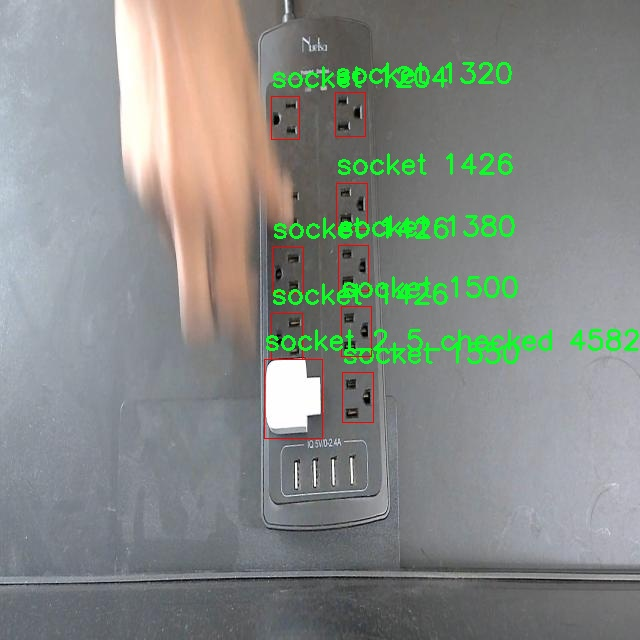

# 插座空置状态检测检测系统源码分享
 # [一条龙教学YOLOV8标注好的数据集一键训练_70+全套改进创新点发刊_Web前端展示]

### 1.研究背景与意义

项目参考[AAAI Association for the Advancement of Artificial Intelligence](https://gitee.com/qunmasj/projects)

项目来源[AACV Association for the Advancement of Computer Vision](https://kdocs.cn/l/cszuIiCKVNis)

研究背景与意义

随着智能家居和物联网技术的迅猛发展，家居环境的智能化管理已成为研究的热点之一。在这一背景下，插座的使用效率和状态监测逐渐引起了人们的关注。插座作为家庭和办公环境中不可或缺的电力供应点，其空置状态的检测不仅可以帮助用户合理利用电力资源，还能有效降低待机能耗，进而推动可持续发展的目标。因此，开发一种高效、准确的插座空置状态检测系统显得尤为重要。

在现有的研究中，传统的插座状态监测方法多依赖于人工检查或简单的电流检测，这些方法不仅效率低下，而且容易受到人为因素的影响，难以实现实时监测。近年来，基于深度学习的目标检测技术逐渐成熟，尤其是YOLO（You Only Look Once）系列模型因其高效的实时检测能力而被广泛应用于各种视觉识别任务。YOLOv8作为该系列的最新版本，具有更强的特征提取能力和更快的推理速度，能够在复杂环境中实现高精度的目标检测。

本研究旨在基于改进的YOLOv8模型，构建一个插座空置状态检测系统。该系统将利用一个包含1900张图像的数据集进行训练，该数据集涵盖了12个类别，包括不同状态的插座（如“socket”、“socket_1_1_checked”等），以及悬停状态（“hovering”）。通过对这些类别的有效识别，系统能够实时监测插座的使用情况，及时反馈插座的空置状态，从而为用户提供有效的电力管理建议。

本研究的意义在于，首先，利用改进的YOLOv8模型进行插座状态检测，可以显著提高检测的准确性和实时性，解决传统方法的局限性。其次，基于深度学习的自动化检测系统将减少人工干预，降低人力成本，提高家庭和办公环境的智能化水平。此外，系统的实施将促进电力资源的合理利用，降低待机能耗，为环保事业贡献一份力量。

综上所述，基于改进YOLOv8的插座空置状态检测系统的研究，不仅具有重要的理论价值，也具备广泛的应用前景。通过该系统的开发与应用，可以为智能家居的发展提供新的思路和解决方案，推动家庭和办公环境的智能化进程，为实现可持续发展目标做出积极贡献。

### 2.图片演示


##### 注意：由于此博客编辑较早，上面“2.图片演示”和“3.视频演示”展示的系统图片或者视频可能为老版本，新版本在老版本的基础上升级如下：（实际效果以升级的新版本为准）

  （1）适配了YOLOV8的“目标检测”模型和“实例分割”模型，通过加载相应的权重（.pt）文件即可自适应加载模型。

  （2）支持“图片识别”、“视频识别”、“摄像头实时识别”三种识别模式。

  （3）支持“图片识别”、“视频识别”、“摄像头实时识别”三种识别结果保存导出，解决手动导出（容易卡顿出现爆内存）存在的问题，识别完自动保存结果并导出到tempDir中。

  （4）支持Web前端系统中的标题、背景图等自定义修改，后面提供修改教程。

  另外本项目提供训练的数据集和训练教程,暂不提供权重文件（best.pt）,需要您按照教程进行训练后实现图片演示和Web前端界面演示的效果。

### 3.视频演示

[3.1 视频演示](https://www.bilibili.com/video/BV1HdsXekEUc/)

### 4.数据集信息展示

##### 4.1 本项目数据集详细数据（类别数＆类别名）

nc: 12
names: ['hovering', 'socket', 'socket_1_1_checked', 'socket_1_2_checked', 'socket_1_3_checked', 'socket_1_4_checked', 'socket_1_5_checked', 'socket_2_1_checked', 'socket_2_2_checked', 'socket_2_3_checked', 'socket_2_4_checked', 'socket_2_5_checked']


##### 4.2 本项目数据集信息介绍

数据集信息展示

在本研究中，我们采用了名为“Project testing k”的数据集，以训练和改进YOLOv8模型，用于插座空置状态的检测系统。该数据集专门设计用于捕捉和识别多种插座状态，具有丰富的多样性和高质量的标注，能够有效支持模型的训练和评估。数据集中包含12个类别，涵盖了不同的插座状态和类型，这些类别分别为：hovering、socket、socket_1_1_checked、socket_1_2_checked、socket_1_3_checked、socket_1_4_checked、socket_1_5_checked、socket_2_1_checked、socket_2_2_checked、socket_2_3_checked、socket_2_4_checked和socket_2_5_checked。

在这12个类别中，“hovering”类别用于表示插座未被使用的状态，作为基线类别，帮助模型识别空置的插座。而其他类别则分别对应不同的插座状态，标识出各个插座在不同情况下的使用情况。例如，socket_1_1_checked至socket_1_5_checked表示第一组插座的不同使用状态，而socket_2_1_checked至socket_2_5_checked则对应第二组插座的状态。这种细致的分类设计，使得数据集能够涵盖插座的多种使用场景，进而提升模型的检测精度和泛化能力。

数据集的构建过程注重多样性和代表性，确保每个类别都包含足够的样本，以便模型能够学习到不同状态下的特征。数据集中的图像样本来自于不同的环境和光照条件，模拟了实际应用中可能遇到的各种情况。这种多样性不仅增强了模型的鲁棒性，还提高了其在实际应用中的适应能力。

在数据预处理阶段，我们对图像进行了标准化处理，包括尺寸调整、数据增强等，以提高模型的训练效果。通过旋转、翻转、亮度调整等技术手段，进一步丰富了数据集的样本，增加了模型对插座状态变化的敏感性。此外，数据集中的标注信息经过严格审核，确保每个样本的标签准确无误，为模型的训练提供了可靠的基础。

通过使用“Project testing k”数据集，我们期望能够显著提升YOLOv8在插座空置状态检测中的性能。该数据集不仅为模型提供了丰富的训练素材，还为后续的模型评估和优化奠定了坚实的基础。随着模型的不断迭代和优化，我们相信能够实现高效、准确的插座状态检测，进而推动智能家居和物联网技术的发展。

总之，“Project testing k”数据集的设计和构建充分考虑了插座状态检测的实际需求，通过多样化的类别和丰富的样本，旨在为YOLOv8模型的训练提供强有力的支持。这一数据集的应用，将为插座空置状态检测系统的研发带来新的机遇和挑战，推动相关技术的进步与应用。





### 5.全套项目环境部署视频教程（零基础手把手教学）

[5.1 环境部署教程链接（零基础手把手教学）](https://www.ixigua.com/7404473917358506534?logTag=c807d0cbc21c0ef59de5)


[5.2 安装Python虚拟环境创建和依赖库安装视频教程链接（零基础手把手教学）](https://www.ixigua.com/7404474678003106304?logTag=1f1041108cd1f708b01a)

### 6.手把手YOLOV8训练视频教程（零基础小白有手就能学会）

[6.1 手把手YOLOV8训练视频教程（零基础小白有手就能学会）](https://www.ixigua.com/7404477157818401292?logTag=d31a2dfd1983c9668658)

### 7.70+种全套YOLOV8创新点代码加载调参视频教程（一键加载写好的改进模型的配置文件）

[7.1 70+种全套YOLOV8创新点代码加载调参视频教程（一键加载写好的改进模型的配置文件）](https://www.ixigua.com/7404478314661806627?logTag=29066f8288e3f4eea3a4)

### 8.70+种全套YOLOV8创新点原理讲解（非科班也可以轻松写刊发刊，V10版本正在科研待更新）

由于篇幅限制，每个创新点的具体原理讲解就不一一展开，具体见下列网址中的创新点对应子项目的技术原理博客网址【Blog】：


[8.1 70+种全套YOLOV8创新点原理讲解链接](https://gitee.com/qunmasj/good)

### 9.系统功能展示（检测对象为举例，实际内容以本项目数据集为准）

图9.1.系统支持检测结果表格显示

  图9.2.系统支持置信度和IOU阈值手动调节

  图9.3.系统支持自定义加载权重文件best.pt(需要你通过步骤5中训练获得)

  图9.4.系统支持摄像头实时识别

  图9.5.系统支持图片识别

  图9.6.系统支持视频识别

  图9.7.系统支持识别结果文件自动保存

  图9.8.系统支持Excel导出检测结果数据


### 10.原始YOLOV8算法原理

原始YOLOv8算法原理

YOLOv8算法是目标检测领域的一个重要里程碑，其在YOLO系列的基础上进行了深度优化和创新，尤其是在轻量化设计和高效特征提取方面。作为2023年1月由Ultralytics发布的最新版本，YOLOv8在前代模型的基础上，结合了多种先进的技术，旨在提升目标检测的精度和速度。该算法的核心在于其独特的网络结构，主要由骨干特征提取网络、特征融合层和检测头层三部分组成。

在骨干特征提取网络层，YOLOv8采用了C2F模块来替代原有的C3模块。C2F模块通过引入更轻量化的卷积操作，使用3×3的卷积核，深度设置为3、6、6、3，显著降低了计算复杂度，同时保持了特征提取的有效性。这种设计不仅提高了模型的运算速度，还在一定程度上减小了模型的存储需求，使得YOLOv8能够在资源受限的环境中运行得更加流畅。

特征融合层是YOLOv8的重要组成部分，其设计灵感来源于特征金字塔网络（FPN）和路径聚合网络（PAN）。在这一层，YOLOv8通过减少降采样层的数量，优化了特征融合的过程。此外，YOLOv8还引入了BiFPN网络，进一步提升了对不同尺度特征信息的提取速度。BiFPN的核心思想是实现高效的双向跨尺度连接和加权特征融合，这使得模型能够在处理多尺度目标时表现得更加灵活和高效。通过删除单输入对应的节点，并在同一层的输入输出节点之间添加连接，YOLOv8能够有效地整合来自不同层次的特征信息，从而提升检测的准确性。

在检测头层，YOLOv8采用了轻量化的解耦头替代了传统的耦合头，进而实现了有锚目标检测的转变。这一创新使得模型在进行目标定位时，能够更好地处理复杂场景中的目标重叠和遮挡问题。通过引入解耦头，YOLOv8能够独立地预测目标的类别和位置，从而提高了检测的精度和鲁棒性。

YOLOv8的训练过程同样经过了精心设计，采用了多尺度训练和测试的策略，以适应不同尺寸的目标。这种策略不仅增强了模型的泛化能力，还提高了其在实际应用中的适应性。此外，YOLOv8在损失函数的设计上也进行了优化，借鉴了PP-YOLOE的相关设计，进一步提升了训练效率和检测性能。

值得一提的是，YOLOv8在实际应用中展现出了广泛的适用性，能够被应用于智能监控、自动驾驶、人脸识别等多个领域。其高精度和快速的帧率，使得YOLOv8在实时检测任务中具有明显的优势。例如，在苹果采摘的应用场景中，YOLOv8能够快速识别和定位目标，为自动采摘机器人提供精准的视觉信息，进而提高采摘效率。

总的来说，YOLOv8算法通过对网络结构的优化和特征提取方法的创新，成功实现了在精度和速度上的双重提升。其轻量化设计和高效的特征融合策略，使得YOLOv8不仅在理论上具有较高的学术价值，更在实际应用中展现出了强大的实用性。随着YOLOv8的不断发展和应用，目标检测领域的研究和实践将迎来新的机遇和挑战。


### 11.项目核心源码讲解（再也不用担心看不懂代码逻辑）

#### 11.1 70+种YOLOv8算法改进源码大全和调试加载训练教程（非必要）\ultralytics\utils\checks.py

以下是对代码中最核心部分的分析和详细中文注释。主要保留了与环境检查、版本检查、依赖解析等相关的功能，去掉了一些冗余的部分。

```python
import contextlib
import os
import platform
import re
import subprocess
import sys
from pathlib import Path
from typing import Optional

import requests
import torch
from ultralytics.utils import LOGGER, ROOT, SimpleNamespace, TryExcept, colorstr

def parse_requirements(file_path=ROOT.parent / 'requirements.txt', package=''):
    """
    解析 requirements.txt 文件，忽略以 '#' 开头的行和 '#' 后的文本。

    参数:
        file_path (Path): requirements.txt 文件的路径。
        package (str, optional): 使用的 Python 包名，默认为空。

    返回:
        (List[Dict[str, str]]): 解析后的需求列表，每个需求以字典形式表示，包含 `name` 和 `specifier` 键。
    """
    if package:
        requires = [x for x in metadata.distribution(package).requires if 'extra == ' not in x]
    else:
        requires = Path(file_path).read_text().splitlines()

    requirements = []
    for line in requires:
        line = line.strip()
        if line and not line.startswith('#'):
            line = line.split('#')[0].strip()  # 忽略行内注释
            match = re.match(r'([a-zA-Z0-9-_]+)\s*([<>!=~]+.*)?', line)
            if match:
                requirements.append(SimpleNamespace(name=match[1], specifier=match[2].strip() if match[2] else ''))

    return requirements


def check_version(current: str = '0.0.0', required: str = '0.0.0', name: str = 'version', hard: bool = False) -> bool:
    """
    检查当前版本是否满足所需版本或范围。

    参数:
        current (str): 当前版本或包名。
        required (str): 所需版本或范围（以 pip 风格格式）。
        name (str, optional): 用于警告消息的名称。
        hard (bool, optional): 如果为 True，当要求不满足时抛出 AssertionError。

    返回:
        (bool): 如果满足要求则返回 True，否则返回 False。
    """
    if not current:  # 如果 current 是 '' 或 None
        LOGGER.warning(f'WARNING ⚠️ invalid check_version({current}, {required}) requested, please check values.')
        return True

    if not required:  # 如果 required 是 '' 或 None
        return True

    result = True
    c = parse_version(current)  # 解析当前版本
    for r in required.strip(',').split(','):
        op, v = re.match(r'([^0-9]*)([\d.]+)', r).groups()  # 分割操作符和版本号
        v = parse_version(v)  # 解析所需版本
        if op == '==' and c != v:
            result = False
        elif op == '!=' and c == v:
            result = False
        elif op in ('>=', '') and not (c >= v):  # 如果没有约束则假设为 '>='
            result = False
        elif op == '<=' and not (c <= v):
            result = False
        elif op == '>' and not (c > v):
            result = False
        elif op == '<' and not (c < v):
            result = False

    if not result:
        warning_message = f'WARNING ⚠️ {name}{op}{required} is required, but {name}=={current} is currently installed'
        if hard:
            raise ModuleNotFoundError(colorstr(warning_message))  # 确保版本要求满足
        LOGGER.warning(warning_message)
    return result


def check_python(minimum: str = '3.8.0') -> bool:
    """
    检查当前 Python 版本是否满足所需的最低版本。

    参数:
        minimum (str): 所需的最低 Python 版本。

    返回:
        None
    """
    return check_version(platform.python_version(), minimum, name='Python ', hard=True)


@TryExcept()
def check_requirements(requirements=ROOT.parent / 'requirements.txt', exclude=(), install=True):
    """
    检查已安装的依赖项是否满足要求，并尝试自动更新。

    参数:
        requirements (Union[Path, str, List[str]]): requirements.txt 文件的路径，单个包要求字符串，或包要求字符串列表。
        exclude (Tuple[str]): 要排除的包名元组。
        install (bool): 如果为 True，尝试自动更新不满足要求的包。

    返回:
        bool: 如果所有要求都满足则返回 True，否则返回 False。
    """
    prefix = colorstr('red', 'bold', 'requirements:')
    check_python()  # 检查 Python 版本
    if isinstance(requirements, Path):  # requirements.txt 文件
        file = requirements.resolve()
        assert file.exists(), f'{prefix} {file} not found, check failed.'
        requirements = [f'{x.name}{x.specifier}' for x in parse_requirements(file) if x.name not in exclude]
    elif isinstance(requirements, str):
        requirements = [requirements]

    pkgs = []
    for r in requirements:
        r_stripped = r.split('/')[-1].replace('.git', '')  # 处理 git 链接
        match = re.match(r'([a-zA-Z0-9-_]+)([<>!=~]+.*)?', r_stripped)
        name, required = match[1], match[2].strip() if match[2] else ''
        try:
            assert check_version(metadata.version(name), required)  # 检查版本
        except (AssertionError, metadata.PackageNotFoundError):
            pkgs.append(r)

    if pkgs and install:  # 如果有不满足要求的包并且允许安装
        s = ' '.join(f'"{x}"' for x in pkgs)  # 控制台字符串
        LOGGER.info(f"{prefix} Ultralytics requirement{'s' * (len(pkgs) > 1)} {pkgs} not found, attempting AutoUpdate...")
        try:
            assert is_online(), 'AutoUpdate skipped (offline)'
            subprocess.check_output(f'pip install --no-cache {s}', shell=True)
            LOGGER.info(f"{prefix} AutoUpdate success ✅")
        except Exception as e:
            LOGGER.warning(f'{prefix} ❌ {e}')
            return False

    return True


def check_cuda() -> bool:
    """
    检查 CUDA 是否在环境中可用。

    返回:
        (bool): 如果有一个或多个 NVIDIA GPU 可用则返回 True，否则返回 False。
    """
    try:
        output = subprocess.check_output(['nvidia-smi', '--query-gpu=count', '--format=csv,noheader,nounits'],
                                         encoding='utf-8')
        return int(output.strip()) > 0
    except (subprocess.CalledProcessError, FileNotFoundError):
        return False


def collect_system_info():
    """收集并打印相关系统信息，包括操作系统、Python、RAM、CPU 和 CUDA。"""
    ram_info = psutil.virtual_memory().total / (1024 ** 3)  # 将字节转换为 GB
    LOGGER.info(f"\n{'OS':<20}{platform.platform()}\n"
                f"{'Python':<20}{sys.version.split()[0]}\n"
                f"{'RAM':<20}{ram_info:.2f} GB\n"
                f"{'CUDA Available':<20}{check_cuda()}\n")
```

### 代码核心部分分析
1. **依赖解析 (`parse_requirements`)**: 该函数用于解析 requirements.txt 文件，提取出所需的包及其版本信息。
2. **版本检查 (`check_version`)**: 该函数用于检查当前版本是否满足要求的版本。
3. **Python 版本检查 (`check_python`)**: 确保当前 Python 版本符合最低要求。
4. **依赖检查与更新 (`check_requirements`)**: 检查当前环境中安装的依赖是否满足要求，并尝试自动更新。
5. **CUDA 检查 (`check_cuda`)**: 检查系统中是否有可用的 NVIDIA GPU。
6. **系统信息收集 (`collect_system_info`)**: 收集并打印系统的基本信息，包括操作系统、Python 版本、内存和 CUDA 可用性。

这些核心功能确保了在使用 YOLO 模型时，环境的兼容性和依赖的完整性。

这个文件是YOLOv8算法实现中的一个实用工具模块，主要用于检查和验证各种依赖、环境和配置，以确保YOLOv8能够正常运行。文件中包含了多个函数，每个函数都有特定的功能。

首先，`parse_requirements`函数用于解析`requirements.txt`文件，提取出所需的Python包及其版本要求。它会忽略以`#`开头的注释行，并将有效的依赖项存储为字典格式的列表。

接下来，`parse_version`函数将版本字符串转换为整数元组，方便进行版本比较。它能够处理如`'2.0.1+cpu'`这样的版本字符串，并返回如`(2, 0, 1)`的格式。

`is_ascii`函数检查给定字符串是否仅由ASCII字符组成，这在处理某些输入时可能很有用。

`check_imgsz`函数验证图像尺寸是否为给定步幅的倍数，并根据需要调整图像尺寸。这对于深度学习模型的输入要求是非常重要的，因为某些模型要求输入尺寸必须是特定值的倍数。

`check_version`函数用于检查当前版本是否满足所需版本的要求，可以根据需要抛出异常或打印警告信息。

`check_latest_pypi_version`和`check_pip_update_available`函数则用于检查PyPI上是否有可用的更新版本，以确保用户使用的是最新的库版本。

`check_font`函数用于检查指定字体是否存在于本地，如果不存在则会从指定URL下载字体。

`check_python`函数检查当前Python版本是否满足最低要求。

`check_requirements`函数则是一个综合性的检查工具，用于验证安装的依赖是否满足YOLOv8的要求，并在需要时尝试自动更新。

`check_torchvision`函数确保安装的PyTorch和Torchvision版本兼容，这对于深度学习框架的正常运行至关重要。

`check_suffix`和`check_yolov5u_filename`函数用于检查文件的后缀名是否符合要求，并对旧的YOLOv5文件名进行更新。

`check_file`和`check_yaml`函数用于查找和下载必要的文件，并确保它们的后缀名正确。

`check_imshow`函数检查当前环境是否支持图像显示，适用于调试和可视化。

`check_yolo`和`collect_system_info`函数则用于收集和打印系统信息，包括操作系统、Python版本、内存、CPU和CUDA信息。

`check_amp`函数用于检查PyTorch的自动混合精度（AMP）功能是否正常，以避免在训练过程中出现NaN损失或零mAP结果。

`git_describe`函数返回人类可读的git描述信息，便于版本管理。

`print_args`函数用于打印函数参数，方便调试。

最后，`cuda_device_count`和`cuda_is_available`函数用于检查环境中可用的NVIDIA GPU数量，以确定CUDA是否可用。

总体来说，这个文件提供了一系列工具函数，帮助开发者确保YOLOv8的运行环境正确配置，依赖项满足要求，并提供了调试和信息收集的功能。

#### 11.2 ui.py

```python
import sys
import subprocess

def run_script(script_path):
    """
    使用当前 Python 环境运行指定的脚本。

    Args:
        script_path (str): 要运行的脚本路径

    Returns:
        None
    """
    # 获取当前 Python 解释器的路径
    python_path = sys.executable

    # 构建运行命令，使用 streamlit 运行指定的脚本
    command = f'"{python_path}" -m streamlit run "{script_path}"'

    # 执行命令并等待其完成
    result = subprocess.run(command, shell=True)
    
    # 检查命令执行结果，如果返回码不为0，则表示出错
    if result.returncode != 0:
        print("脚本运行出错。")


# 主程序入口
if __name__ == "__main__":
    # 指定要运行的脚本路径
    script_path = "web.py"  # 假设脚本在当前目录下

    # 调用函数运行脚本
    run_script(script_path)
```

### 代码核心部分说明：
1. **导入模块**：
   - `sys`：用于获取当前 Python 解释器的路径。
   - `subprocess`：用于执行外部命令。

2. **`run_script` 函数**：
   - 该函数接收一个脚本路径作为参数，并使用当前 Python 环境运行该脚本。
   - 使用 `sys.executable` 获取当前 Python 解释器的路径。
   - 构建命令字符串，使用 `streamlit` 模块运行指定的脚本。
   - 使用 `subprocess.run` 执行命令，并检查返回码以判断脚本是否成功运行。

3. **主程序入口**：
   - 在 `if __name__ == "__main__":` 块中，指定要运行的脚本路径，并调用 `run_script` 函数执行该脚本。

这个程序文件名为 `ui.py`，主要功能是通过当前的 Python 环境运行一个指定的脚本。程序首先导入了必要的模块，包括 `sys`、`os` 和 `subprocess`，以及一个自定义的路径处理模块 `abs_path`。

在 `run_script` 函数中，程序接受一个参数 `script_path`，这个参数是要运行的脚本的路径。函数首先获取当前 Python 解释器的路径，使用 `sys.executable` 来实现。接着，程序构建一个命令字符串，这个命令使用了 `streamlit` 模块来运行指定的脚本。具体来说，命令格式为 `"{python_path}" -m streamlit run "{script_path}"`，其中 `python_path` 是当前 Python 解释器的路径，`script_path` 是传入的脚本路径。

然后，程序使用 `subprocess.run` 方法来执行这个命令，`shell=True` 参数表示在 shell 中执行命令。执行完命令后，程序检查返回的结果，如果返回码不为 0，表示脚本运行出错，此时会打印出错误信息。

在文件的最后部分，程序通过 `if __name__ == "__main__":` 来判断是否是直接运行该脚本。如果是，程序会调用 `abs_path` 函数来获取 `web.py` 脚本的绝对路径，并将其传递给 `run_script` 函数，从而启动该脚本的运行。

总体来说，这个程序的主要目的是为了方便地运行一个名为 `web.py` 的脚本，并且在运行过程中能够处理可能出现的错误。

#### 11.3 code\ultralytics\models\yolo\obb\train.py

以下是代码中最核心的部分，并附上详细的中文注释：

```python
# 引入必要的库和模块
from ultralytics.models import yolo
from ultralytics.nn.tasks import OBBModel
from ultralytics.utils import DEFAULT_CFG, RANK

class OBBTrainer(yolo.detect.DetectionTrainer):
    """
    OBBTrainer类扩展了DetectionTrainer类，用于基于定向边界框（OBB）模型的训练。
    """

    def __init__(self, cfg=DEFAULT_CFG, overrides=None, _callbacks=None):
        """初始化OBBTrainer对象，接受配置和其他参数。"""
        if overrides is None:
            overrides = {}
        # 设置任务类型为'obb'
        overrides["task"] = "obb"
        # 调用父类的初始化方法
        super().__init__(cfg, overrides, _callbacks)

    def get_model(self, cfg=None, weights=None, verbose=True):
        """返回使用指定配置和权重初始化的OBBModel模型。"""
        # 创建OBBModel实例，指定输入通道数和类别数
        model = OBBModel(cfg, ch=3, nc=self.data["nc"], verbose=verbose and RANK == -1)
        # 如果提供了权重，则加载权重
        if weights:
            model.load(weights)

        return model

    def get_validator(self):
        """返回OBBValidator实例，用于YOLO模型的验证。"""
        # 定义损失名称
        self.loss_names = "box_loss", "cls_loss", "dfl_loss"
        # 返回OBBValidator实例
        return yolo.obb.OBBValidator(self.test_loader, save_dir=self.save_dir, args=copy(self.args))
```

### 代码注释说明：
1. **引入模块**：引入了YOLO模型相关的模块和默认配置，方便后续使用。
2. **OBBTrainer类**：这是一个继承自`DetectionTrainer`的类，专门用于训练OBB模型。
3. **初始化方法**：在初始化时，设置任务类型为`obb`，并调用父类的初始化方法，确保父类的设置也被正确初始化。
4. **获取模型方法**：`get_model`方法用于创建并返回一个OBB模型实例，可以选择性地加载预训练权重。
5. **获取验证器方法**：`get_validator`方法返回一个OBB验证器实例，用于在训练过程中对模型进行验证，并定义了损失名称以便后续使用。

这个程序文件是用于训练基于定向边界框（Oriented Bounding Box, OBB）模型的YOLO（You Only Look Once）框架的一部分。它定义了一个名为`OBBTrainer`的类，该类继承自`DetectionTrainer`，并专门用于处理OBB模型的训练任务。

在文件的开头，导入了一些必要的模块和类，包括`copy`、`yolo`模块、`OBBModel`类以及一些工具函数。接着，`OBBTrainer`类的文档字符串中给出了该类的简要说明和使用示例，展示了如何创建一个`OBBTrainer`实例并调用其`train`方法进行训练。

`OBBTrainer`类的构造函数`__init__`接受三个参数：`cfg`（配置），`overrides`（覆盖的参数），和`_callbacks`（回调函数）。如果没有提供`overrides`，则初始化为空字典。然后，它将任务类型设置为“obb”，并调用父类的构造函数进行初始化。

`get_model`方法用于返回一个初始化的`OBBModel`实例，该实例根据提供的配置和权重进行设置。该方法接受三个参数：`cfg`（配置），`weights`（权重文件），和`verbose`（是否详细输出）。在方法内部，创建了一个`OBBModel`对象，并在提供权重的情况下加载这些权重。

`get_validator`方法返回一个`OBBValidator`实例，用于验证YOLO模型的性能。在这个方法中，定义了损失名称，包括“box_loss”、“cls_loss”和“dfl_loss”，并返回一个`OBBValidator`对象，传入测试数据加载器、保存目录和参数的副本。

总体来说，这个文件的主要功能是定义一个用于训练和验证OBB模型的类，提供了模型初始化和验证的相关方法，使得用户能够方便地进行模型训练和评估。

#### 11.4 70+种YOLOv8算法改进源码大全和调试加载训练教程（非必要）\ultralytics\utils\instance.py

以下是经过简化和注释的核心代码部分，主要保留了 `Bboxes` 和 `Instances` 类的核心功能。

```python
import numpy as np

class Bboxes:
    """
    处理边界框的类，支持多种格式，如 'xyxy'、'xywh' 和 'ltwh'。
    """

    def __init__(self, bboxes, format='xyxy') -> None:
        """
        初始化 Bboxes 类，设置边界框数据和格式。
        
        参数:
            bboxes (numpy.ndarray): 边界框数据，形状为 [N, 4]。
            format (str): 边界框格式，默认为 'xyxy'。
        """
        assert format in ['xyxy', 'xywh', 'ltwh'], f'无效的边界框格式: {format}'
        bboxes = bboxes[None, :] if bboxes.ndim == 1 else bboxes
        assert bboxes.ndim == 2 and bboxes.shape[1] == 4
        self.bboxes = bboxes  # 存储边界框数据
        self.format = format  # 存储边界框格式

    def convert(self, format):
        """将边界框格式转换为指定格式。"""
        assert format in ['xyxy', 'xywh', 'ltwh'], f'无效的边界框格式: {format}'
        if self.format == format:
            return
        # 根据当前格式和目标格式选择转换函数
        func = self._get_conversion_function(format)
        self.bboxes = func(self.bboxes)  # 执行转换
        self.format = format  # 更新格式

    def _get_conversion_function(self, format):
        """根据当前格式和目标格式返回相应的转换函数。"""
        if self.format == 'xyxy':
            return xyxy2xywh if format == 'xywh' else xyxy2ltwh
        elif self.format == 'xywh':
            return xywh2xyxy if format == 'xyxy' else xywh2ltwh
        else:
            return ltwh2xyxy if format == 'xyxy' else ltwh2xywh

    def areas(self):
        """计算并返回每个边界框的面积。"""
        self.convert('xyxy')  # 确保格式为 'xyxy'
        return (self.bboxes[:, 2] - self.bboxes[:, 0]) * (self.bboxes[:, 3] - self.bboxes[:, 1])

    def __len__(self):
        """返回边界框的数量。"""
        return len(self.bboxes)

class Instances:
    """
    存储图像中检测到的对象的边界框、分段和关键点的容器。
    """

    def __init__(self, bboxes, segments=None, keypoints=None, bbox_format='xywh', normalized=True) -> None:
        """
        初始化 Instances 类，设置边界框、分段和关键点。
        
        参数:
            bboxes (numpy.ndarray): 边界框数据，形状为 [N, 4]。
            segments (list | ndarray): 对象分段数据，默认为 None。
            keypoints (ndarray): 关键点数据，形状为 [N, 17, 3]，默认为 None。
            bbox_format (str): 边界框格式，默认为 'xywh'。
            normalized (bool): 是否为归一化坐标，默认为 True。
        """
        self._bboxes = Bboxes(bboxes=bboxes, format=bbox_format)  # 创建 Bboxes 对象
        self.keypoints = keypoints  # 存储关键点
        self.normalized = normalized  # 存储归一化标志
        self.segments = self._process_segments(segments)  # 处理分段数据

    def _process_segments(self, segments):
        """处理分段数据，确保其形状正确。"""
        if segments is None:
            return np.zeros((0, 1000, 2), dtype=np.float32)  # 返回空的分段数据
        segments = resample_segments(segments)  # 重新采样分段
        return np.stack(segments, axis=0)  # 堆叠分段数据

    def convert_bbox(self, format):
        """转换边界框格式。"""
        self._bboxes.convert(format=format)

    @property
    def bbox_areas(self):
        """计算并返回边界框的面积。"""
        return self._bboxes.areas()

    def __getitem__(self, index) -> 'Instances':
        """
        使用索引获取特定实例或实例集。
        
        参数:
            index (int, slice, or np.ndarray): 索引或切片。
        
        返回:
            Instances: 包含选定边界框、分段和关键点的实例对象。
        """
        segments = self.segments[index] if len(self.segments) else self.segments
        keypoints = self.keypoints[index] if self.keypoints is not None else None
        bboxes = self._bboxes[index]
        bbox_format = self._bboxes.format
        return Instances(bboxes=bboxes, segments=segments, keypoints=keypoints, bbox_format=bbox_format, normalized=self.normalized)

    def __len__(self):
        """返回实例的数量。"""
        return len(self._bboxes)
```

### 代码说明：
1. **Bboxes 类**：用于处理边界框的主要类，支持不同的格式（`xyxy`、`xywh`、`ltwh`），提供了初始化、格式转换、面积计算等功能。
2. **Instances 类**：用于存储和处理图像中检测到的对象的边界框、分段和关键点，提供了初始化、格式转换、索引访问等功能。
3. **注释**：每个方法和类都附有详细的中文注释，解释其功能和参数。

这个程序文件主要定义了两个类：`Bboxes`和`Instances`，用于处理目标检测中的边界框（bounding boxes）和相关的实例信息。文件的功能是支持不同格式的边界框操作，包括转换、缩放、归一化等。

首先，`Bboxes`类用于管理边界框，支持三种格式：`xyxy`（左上角和右下角坐标）、`xywh`（中心坐标和宽高）以及`ltwh`（左上角坐标和宽高）。在初始化时，`Bboxes`类会检查输入的格式是否有效，并确保边界框数据是一个二维的NumPy数组。该类提供了多种方法，包括格式转换、计算面积、缩放、添加偏移量等。

`convert`方法用于将边界框从一种格式转换为另一种格式，具体转换逻辑依赖于当前格式和目标格式。`areas`方法计算并返回所有边界框的面积。`mul`和`add`方法则分别用于对边界框的坐标进行缩放和添加偏移量。

`Instances`类是一个更复杂的容器，除了包含边界框外，还可以存储分割信息（segments）和关键点（keypoints）。在初始化时，`Instances`类会创建一个`Bboxes`对象来处理边界框，并对分割信息进行重采样。该类同样提供了多种方法，包括格式转换、缩放、归一化、添加填充等。

此外，`Instances`类还实现了多种操作，如翻转、裁剪和移除零面积的边界框。它支持通过索引获取特定的实例，允许用户方便地处理多个实例数据。最后，`concatenate`方法可以将多个`Instances`对象合并为一个，确保合并后的对象保持一致的属性。

总的来说，这个文件提供了一个灵活且功能强大的接口，用于处理目标检测任务中的边界框和相关实例信息，适用于YOLO等深度学习模型的实现和调试。

#### 11.5 70+种YOLOv8算法改进源码大全和调试加载训练教程（非必要）\ultralytics\models\fastsam\__init__.py

以下是代码中最核心的部分，并附上详细的中文注释：

```python
# 导入必要的模块和类
from .model import FastSAM  # 从当前包的model模块导入FastSAM类
from .predict import FastSAMPredictor  # 从当前包的predict模块导入FastSAMPredictor类
from .prompt import FastSAMPrompt  # 从当前包的prompt模块导入FastSAMPrompt类
from .val import FastSAMValidator  # 从当前包的val模块导入FastSAMValidator类

# 定义模块的公开接口
__all__ = 'FastSAMPredictor', 'FastSAM', 'FastSAMPrompt', 'FastSAMValidator'
```

### 代码注释说明：
1. **导入模块**：
   - `from .model import FastSAM`：从当前包的 `model` 模块中导入 `FastSAM` 类，通常这个类可能与模型的定义或构建有关。
   - `from .predict import FastSAMPredictor`：从 `predict` 模块中导入 `FastSAMPredictor` 类，这个类可能用于执行预测任务。
   - `from .prompt import FastSAMPrompt`：从 `prompt` 模块中导入 `FastSAMPrompt` 类，可能与用户输入或提示相关。
   - `from .val import FastSAMValidator`：从 `val` 模块中导入 `FastSAMValidator` 类，通常用于模型验证或评估。

2. **定义公开接口**：
   - `__all__` 是一个特殊变量，用于定义模块的公共接口。当使用 `from module import *` 时，只有在 `__all__` 中列出的名称会被导入。这有助于控制模块的可见性和使用方式。这里列出了四个类，表示它们是该模块的核心功能部分。

这个程序文件是一个Python模块的初始化文件，属于Ultralytics YOLO项目的一部分，主要用于实现FastSAM（Fast Segment Anything Model）相关的功能。文件的开头包含了版权信息，说明该代码遵循AGPL-3.0许可证。

在文件中，首先从当前包中导入了四个类或函数：FastSAM、FastSAMPredictor、FastSAMPrompt和FastSAMValidator。这些导入的内容可能是实现FastSAM模型、进行预测、处理提示信息以及验证模型的相关功能。

最后，`__all__`变量被定义为一个包含字符串的元组，列出了该模块公开的接口。这意味着当使用`from module import *`语句时，只会导入这些指定的类或函数。这种做法有助于控制模块的可见性，确保用户只接触到模块的核心功能，而不被内部实现细节所干扰。

总体来说，这个文件的作用是组织和管理FastSAM相关的功能模块，为用户提供一个清晰的接口，以便于使用和扩展。

#### 11.6 train.py

以下是代码中最核心的部分，并附上详细的中文注释：

```python
class DetectionTrainer(BaseTrainer):
    """
    DetectionTrainer类，继承自BaseTrainer类，用于基于检测模型的训练。
    """

    def build_dataset(self, img_path, mode="train", batch=None):
        """
        构建YOLO数据集。

        参数:
            img_path (str): 包含图像的文件夹路径。
            mode (str): 模式，`train`表示训练模式，`val`表示验证模式，用户可以为每种模式自定义不同的数据增强。
            batch (int, optional): 批次大小，仅用于`rect`模式。默认为None。
        """
        gs = max(int(de_parallel(self.model).stride.max() if self.model else 0), 32)  # 获取模型的最大步幅
        return build_yolo_dataset(self.args, img_path, batch, self.data, mode=mode, rect=mode == "val", stride=gs)

    def get_dataloader(self, dataset_path, batch_size=16, rank=0, mode="train"):
        """构造并返回数据加载器。"""
        assert mode in ["train", "val"]  # 确保模式为训练或验证
        with torch_distributed_zero_first(rank):  # 仅在DDP情况下初始化数据集
            dataset = self.build_dataset(dataset_path, mode, batch_size)  # 构建数据集
        shuffle = mode == "train"  # 训练模式下打乱数据
        if getattr(dataset, "rect", False) and shuffle:
            LOGGER.warning("WARNING ⚠️ 'rect=True'与DataLoader的shuffle不兼容，设置shuffle=False")
            shuffle = False  # 如果是rect模式且需要打乱，则不打乱
        workers = self.args.workers if mode == "train" else self.args.workers * 2  # 设置工作线程数
        return build_dataloader(dataset, batch_size, workers, shuffle, rank)  # 返回数据加载器

    def preprocess_batch(self, batch):
        """对一批图像进行预处理，包括缩放和转换为浮点数。"""
        batch["img"] = batch["img"].to(self.device, non_blocking=True).float() / 255  # 将图像转移到设备并归一化
        if self.args.multi_scale:  # 如果启用多尺度
            imgs = batch["img"]
            sz = (
                random.randrange(self.args.imgsz * 0.5, self.args.imgsz * 1.5 + self.stride)
                // self.stride
                * self.stride
            )  # 随机选择新的尺寸
            sf = sz / max(imgs.shape[2:])  # 计算缩放因子
            if sf != 1:
                ns = [
                    math.ceil(x * sf / self.stride) * self.stride for x in imgs.shape[2:]
                ]  # 计算新的形状
                imgs = nn.functional.interpolate(imgs, size=ns, mode="bilinear", align_corners=False)  # 进行插值
            batch["img"] = imgs  # 更新批次中的图像
        return batch

    def get_model(self, cfg=None, weights=None, verbose=True):
        """返回YOLO检测模型。"""
        model = DetectionModel(cfg, nc=self.data["nc"], verbose=verbose and RANK == -1)  # 创建检测模型
        if weights:
            model.load(weights)  # 加载权重
        return model

    def get_validator(self):
        """返回用于YOLO模型验证的DetectionValidator。"""
        self.loss_names = "box_loss", "cls_loss", "dfl_loss"  # 定义损失名称
        return yolo.detect.DetectionValidator(
            self.test_loader, save_dir=self.save_dir, args=copy(self.args), _callbacks=self.callbacks
        )  # 返回验证器

    def plot_training_samples(self, batch, ni):
        """绘制带有注释的训练样本。"""
        plot_images(
            images=batch["img"],
            batch_idx=batch["batch_idx"],
            cls=batch["cls"].squeeze(-1),
            bboxes=batch["bboxes"],
            paths=batch["im_file"],
            fname=self.save_dir / f"train_batch{ni}.jpg",
            on_plot=self.on_plot,
        )  # 绘制图像并保存

    def plot_metrics(self):
        """从CSV文件中绘制指标。"""
        plot_results(file=self.csv, on_plot=self.on_plot)  # 保存结果图像
```

### 代码核心部分说明：
1. **DetectionTrainer类**：该类负责YOLO模型的训练过程，继承自基础训练类`BaseTrainer`。
2. **build_dataset方法**：用于构建YOLO数据集，支持训练和验证模式。
3. **get_dataloader方法**：构造数据加载器，负责数据的批处理和加载。
4. **preprocess_batch方法**：对输入的图像批次进行预处理，包括归一化和多尺度调整。
5. **get_model方法**：创建并返回YOLO检测模型，可以选择加载预训练权重。
6. **get_validator方法**：返回用于模型验证的验证器。
7. **plot_training_samples和plot_metrics方法**：用于可视化训练样本和训练过程中的指标。

这个程序文件 `train.py` 是一个用于训练 YOLO（You Only Look Once）目标检测模型的实现，基于 Ultralytics 的框架。程序的核心是 `DetectionTrainer` 类，它继承自 `BaseTrainer` 类，专门用于处理目标检测任务。

在文件的开头，导入了一些必要的库和模块，包括数学运算、随机数生成、深度学习相关的库（如 PyTorch），以及 Ultralytics 提供的各种工具和函数。

`DetectionTrainer` 类中定义了多个方法，首先是 `build_dataset` 方法，它用于构建 YOLO 数据集。这个方法接收图像路径、模式（训练或验证）和批量大小作为参数，并调用 `build_yolo_dataset` 函数来创建数据集。这里还考虑了模型的步幅，以确保数据集的构建与模型的要求相匹配。

接下来是 `get_dataloader` 方法，它用于构建数据加载器。根据传入的模式（训练或验证），它会初始化数据集，并根据需要设置数据加载的参数，如是否打乱数据和工作线程的数量。

`preprocess_batch` 方法负责对每个批次的图像进行预处理，包括将图像缩放到适当的大小并转换为浮点数格式。这个方法还支持多尺度训练，通过随机选择图像的大小来增强模型的鲁棒性。

`set_model_attributes` 方法用于设置模型的属性，包括类别数量和类别名称，这些信息是从数据集中提取的。这样可以确保模型在训练时能够正确识别和分类目标。

`get_model` 方法用于返回一个 YOLO 检测模型，可以根据配置文件和权重文件来初始化模型。

`get_validator` 方法返回一个用于验证模型性能的验证器，包含损失名称以便于后续的监控和分析。

`label_loss_items` 方法用于返回一个包含训练损失项的字典，方便在训练过程中记录和显示损失信息。

`progress_string` 方法生成一个格式化的字符串，用于显示训练进度，包括当前的轮次、GPU 内存使用情况、损失值、实例数量和图像大小等信息。

`plot_training_samples` 方法用于绘制训练样本及其标注，帮助可视化训练数据的质量。

最后，`plot_metrics` 和 `plot_training_labels` 方法用于绘制训练过程中的指标和标签，分别从 CSV 文件和数据集中提取信息，并生成可视化结果。

整体而言，这个程序文件提供了一个完整的框架，用于训练 YOLO 模型，涵盖了数据集构建、数据加载、模型初始化、训练过程监控和结果可视化等多个方面。

### 12.系统整体结构（节选）

### 整体功能和构架概括

该项目是一个基于YOLOv8框架的目标检测系统，旨在提供一个灵活且高效的环境，用于训练和推理各种YOLO模型。项目的结构分为多个模块，每个模块负责特定的功能，如模型训练、数据处理、模型验证、实用工具等。整体架构支持不同类型的目标检测任务，包括常规边界框检测和定向边界框检测（OBB），并提供了一系列工具和实用函数，以便于用户进行模型的调试和优化。

### 文件功能整理表

| 文件路径                                                                 | 功能描述                                                         |
|------------------------------------------------------------------------|----------------------------------------------------------------|
| `ultralytics/utils/checks.py`                                          | 检查环境和依赖，确保YOLOv8正常运行，包含多种验证和检查函数。     |
| `ui.py`                                                                | 运行指定的脚本（如web.py），处理命令行参数和错误输出。             |
| `ultralytics/models/yolo/obb/train.py`                                 | 定义用于训练定向边界框（OBB）模型的类，包含模型初始化和验证功能。 |
| `ultralytics/utils/instance.py`                                        | 管理目标检测中的边界框和实例信息，提供格式转换和操作方法。       |
| `ultralytics/models/fastsam/__init__.py`                               | 初始化FastSAM模块，导入相关类和函数，提供模块接口。               |
| `train.py`                                                             | 训练YOLO模型的主程序，处理数据集构建、模型初始化和训练过程监控。   |
| `ultralytics/engine/trainer.py`                                       | 定义训练器类，负责训练过程的管理和优化，包含训练循环和损失计算。   |
| `ultralytics/nn/modules/utils.py`                                     | 提供神经网络模块的实用工具函数，可能包括层定义和初始化方法。       |
| `ultralytics/utils/callbacks/hub.py`                                  | 定义回调函数，用于在训练过程中进行监控和记录，支持模型保存等功能。 |
| `ultralytics/models/utils/ops.py`                                     | 提供模型操作的实用函数，可能包括图像处理和后处理方法。             |
| `ultralytics/utils/benchmarks.py`                                     | 提供性能基准测试的工具，帮助评估模型的速度和效率。                 |
| `ultralytics/models/yolo/detect/train.py`                              | 训练YOLO检测模型的实现，包含数据加载、模型训练和评估功能。       |
| `ultralytics/utils/checks.py`                                          | （重复）检查环境和依赖，确保YOLOv8正常运行，包含多种验证和检查函数。 |

### 总结

该项目通过模块化设计，使得目标检测模型的训练、验证和推理过程变得高效且易于管理。每个文件和模块都承担了特定的职责，促进了代码的可读性和可维护性，便于用户进行扩展和定制。

注意：由于此博客编辑较早，上面“11.项目核心源码讲解（再也不用担心看不懂代码逻辑）”中部分代码可能会优化升级，仅供参考学习，完整“训练源码”、“Web前端界面”和“70+种创新点源码”以“13.完整训练+Web前端界面+70+种创新点源码、数据集获取”的内容为准。

### 13.完整训练+Web前端界面+70+种创新点源码、数据集获取


# [下载链接：https://mbd.pub/o/bread/ZpuZkpZw](https://mbd.pub/o/bread/ZpuZkpZw)